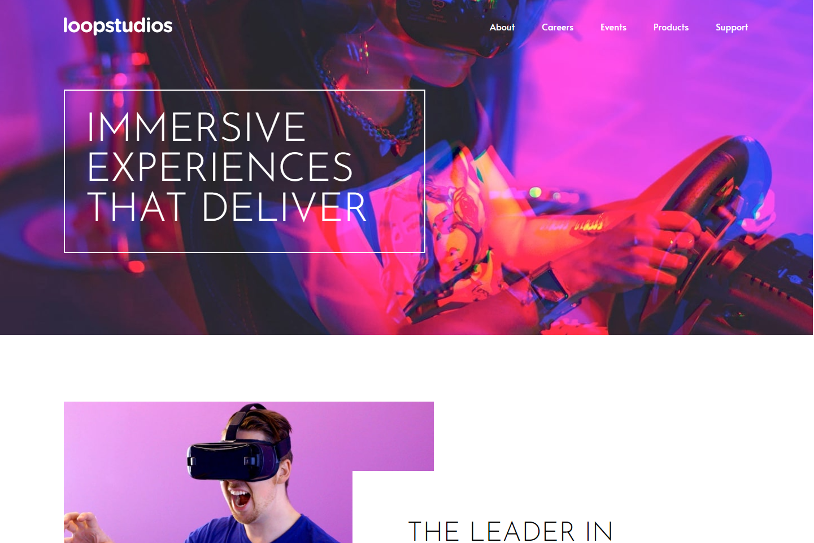

# Frontend Mentor - Loopstudios landing page solution

This is a solution to the [Loopstudios landing page challenge on Frontend Mentor](https://www.frontendmentor.io/challenges/loopstudios-landing-page-N88J5Onjw). Frontend Mentor challenges help you improve your coding skills by building realistic projects.

## Table of contents

- [Overview](#overview)
  - [The challenge](#the-challenge)
  - [Screenshot](#screenshot)
  - [Links](#links)
- [My process](#my-process)
  - [Built with](#built-with)
  - [What I learned](#what-i-learned)
  - [Continued development](#continued-development)
  - [Useful resources](#useful-resources)
- [Author](#author)

## Overview

### The challenge

Users should be able to:

- View the optimal layout for the site depending on their device's screen size
- See hover states for all interactive elements on the page

### Screenshot

### Links

- Solution URL: [Solution](https://your-solution-url.com)
- Live Site URL: [Preview](https://your-live-site-url.com)

## My process

### Built with

- Semantic HTML5 markup
- CSS custom properties
- Flexbox
- CSS Grid
- Mobile-first workflow

### Continued development

- Learn more about new CSS properties like `min()`, `max()` and `clamp()`
- Understand how grid `auto-fit` and `auto-fill` works

### Useful resources

- [Fluid Typography](https://fluid-typography.netlify.app/) - This helped generate font-sizes while leveraging the clamp function

## Author

- Website - [Paul Aromolaran](https://github.com/PaulAroo)
- Frontend Mentor - [@PaulAroo](https://www.frontendmentor.io/profile/PaulAroo)
- Twitter - [@paul_aroo](https://twitter.com/paul_aroo)
